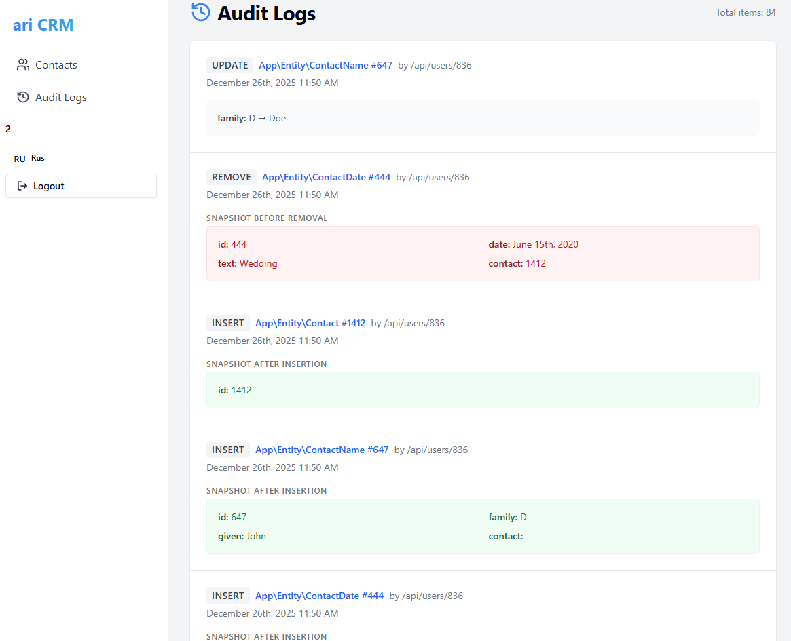
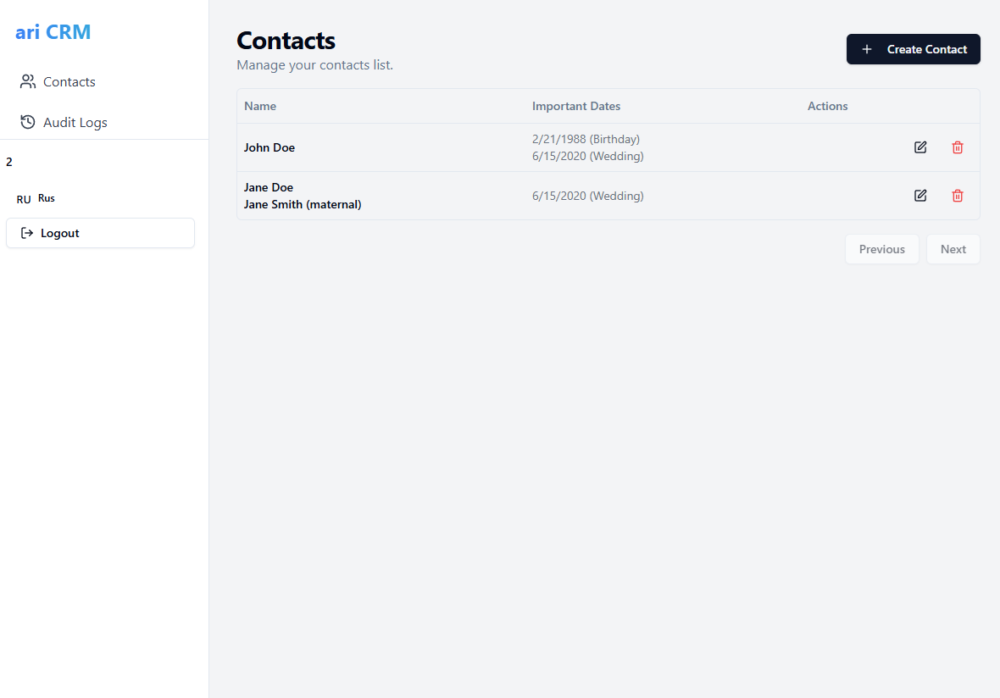
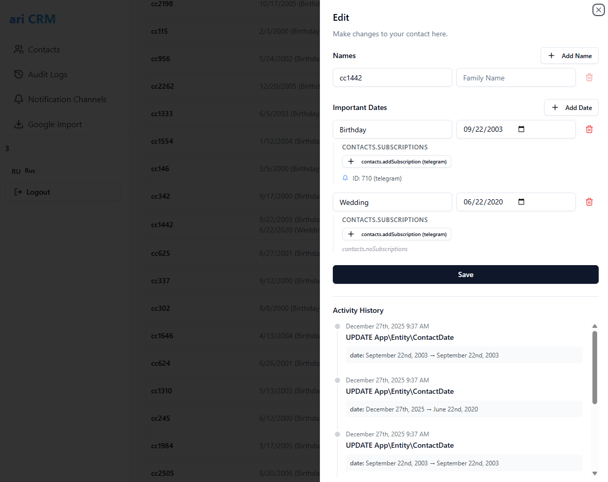
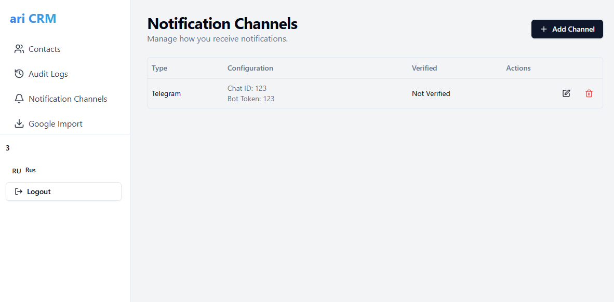
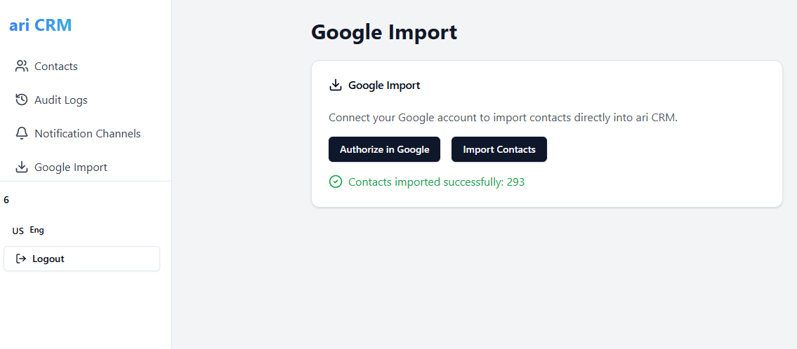

# Ari

**Ari** is a self-hosted personal CRM built around **immutable history and reliable notifications**.
  
It is designed for people who want full control over their personal data, complete change history, and the ability to self-host with 100% privacy.

Ari is an alternative to MonicaHQ, built with a strong emphasis on transparency, auditability, and longevity.

---
## Why this exists

This project started from a very practical frustration.

I used **MonicaHQ** for a long time. One of my favorite features was email notifications for important dates, like birthdays. Over time, the project felt stagnant, but it still worked well enough — until one day it didn’t.

On my self-hosted Monica instance, something went wrong. Part of the notification data disappeared from the database. Fixing it meant digging into internals and re-configuring everything from scratch. I didn’t. I simply stopped using the product.

Later, I experimented with managing contacts in **Obsidian**, treating them as notes. I even built my own plugin to sync Google Contacts. This worked well for data ownership and flexibility, but it still lacked one crucial thing: **reliable, cross-platform notifications**.

At that point, it became clear that I wanted something different:
- a system where **data history is never silently lost**
- a system where **notifications are treated as first-class, reliable features**
- a system I can **fully trust**, inspect, and self-host

That is how Ari started.

---
## Core principles

- **History-first**  
    All meaningful changes are recorded. Losing context or history is not acceptable.
- **Reliable notifications**  
    Notifications are not a “nice to have” feature. They are part of the core value.
- **Data ownership**  
    You can self-host Ari and keep full control over your data.
- **Open source by default**  
    Transparency builds trust. All core logic is open and auditable.
- **Privacy by design**  
    No tracking, no dark patterns, no data extraction incentives.
- **Monolith first, clean architecture**  
    Start simple. Optimize and split only when the system proves it needs it.

---
## What exists today

Ari is still an early-stage project, but it already provides **real, working functionality**.

### Core features

- User authentication and strict data ownership
- Contact management with a structured domain model:
    - Contacts
    - Multiple names per contact
    - Multiple dates per contact (birthdays, anniversaries, custom dates)
- **Audit log**:
    - full history of contact lifecycle
    - visibility into create, update, and delete operations
- **Notification system**:
    - configurable notification channels
    - date-based notification subscriptions
    - delivery log for sent notifications
    - first implemented channel: **Telegram**

### Integrations

- **Google Contacts import** (basic, early version)

### Web client

- React-based UI with multi-language support
- Contact list with create, edit, and delete flows
- Audit log UI with pagination and filtering
- Notification configuration via the UI

### Platform & quality

- Dockerized development environment
- Fully documented API (OpenAPI)
- Extensive automated tests (backend and frontend)
- Strict static analysis, linters, and format checks

This is no longer just a technical foundation.  
It is an **early but usable system**, still evolving and not yet production-ready.

Some workflows are still rough, and parts of the system are intentionally over-engineered for correctness rather than UX polish.

---
## Architecture at a glance

### Backend

- **PHP 8.5**
- **Symfony 7.4**
- **API Platform** (OpenAPI-first)
- **MariaDB**
- Token-based authentication
- Strict user data isolation at the Doctrine level (no accidental data leaks)
- Audit logging via Doctrine event subscribers (history by default)

### Frontend

- **React**
- Multilingual UI
- Typed API client generated from OpenAPI
- Strict linting, static analysis, and automated tests

### Infrastructure

- Docker-based development environment
- Cron-based background jobs (notifications)
- Designed for self-hosting from day one

The architecture favors **clarity, correctness, and long-term maintainability** over early optimization or premature distribution.

---
## Project status & expectations

Ari is an **early but functional project**.

- This is a **solo-developed** project.
- Development is active and happens at a sustainable pace.
- The core architecture and data model are in place.
- Key features such as contacts, audit logs, and notifications already exist and are working.
- There are **no fixed deadlines**, and breaking changes are still possible.

Ari is **not production-ready yet**, and some areas require further work (performance, imports, self-hosting polish).  
However, the project already delivers real value and is actively evolving.

If you are looking for a polished, feature-complete CRM today, Ari is probably not for you.  
If you care about **data reliability, transparent history, and trustworthy notifications**, and are comfortable with an evolving system — Ari may be worth following or experimenting with early.

---
## Screenshots

Here are some screenshots of the project as it currently looks:

