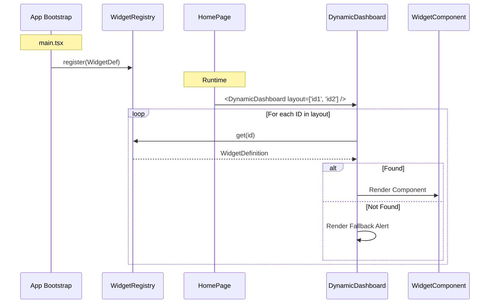

# Widget System Architecture

## Overview
The Widget System allows for a dynamic dashboard where the composition and layout of widgets can be driven by configuration rather than hardcoded logic. This enables future features such as user-customizable dashboards.

## Core Components

### 1. Widget Registry (`src/lib/widgets/WidgetRegistry.ts`)
A singleton registry that stores definitions of all available widgets in the application.

### 2. Widget Definition
Each widget is defined by a `WidgetDefinition` interface:
- **`id`**: Unique string identifier (e.g., `'recent-updates'`).
- **`title`**: Human-readable name for the catalog.
- **`component`**: The React component to render.
- **`defaultDimensions`**: Preferred dimensions (`w`, `h`) in a 12-column grid system.

### 3. Dynamic Dashboard (`src/features/dashboard/DynamicDashboard.tsx`)
A generic container that accepts a list of widget IDs (`layout`) and renders them using a responsive grid system. It handles:
- Looking up widgets in the registry.
- Applying layout dimensions (width).
- Rendering a safe fallback if a widget is missing.

## Data Flow

## Grid System
The dashboard uses a **12-column grid system**.
- **Desktop (`lg`)**: Widgets span `w` columns (1-12).
- **Tablet (`md`)**: Widgets adhere to the same 12-column system (using `md:col-span-w`).
- **Mobile**: Widgets stack vertically (full width).

## Registration
Widgets are registered at application startup. See `src/features/dashboard/widgets/registerWidgets.ts`.
