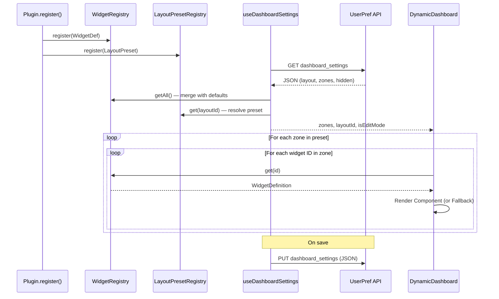

# Widget System Architecture

## Overview
The Widget System provides a fully customizable dashboard where users can toggle widgets on/off, reorder them via drag-and-drop, move them between layout zones, and switch between preset layouts. The system is registry-driven, allowing plugins to register their own widgets and layout presets seamlessly.

## Core Components

### 1. Widget Registry (`src/lib/widgets/WidgetRegistry.ts`)
A singleton registry that stores definitions of all available widgets in the application.

### 2. Widget Definition
Each widget is defined by a `WidgetDefinition` interface:
- **`id`**: Unique string identifier (e.g., `'stats'`).
- **`title`**: Human-readable name (translation key).
- **`description`**: Optional description shown in the toggle panel (translation key).
- **`icon`**: Optional icon component shown in the toggle panel.
- **`component`**: The React component to render.
- **`defaultDimensions`**: Preferred dimensions (`w`, `h`). The `w` value determines default zone placement: `w >= 12` → full-width zone, `w > 6` → left/main zone, `w <= 6` → right/sidebar zone.

### 3. Layout Preset Registry (`src/lib/widgets/LayoutPresets.ts`)
A singleton registry for dashboard layout configurations. Each preset defines a set of zones with display labels and flex-basis values.

Built-in presets:
- **Single Column** — one `main` zone (100%)
- **Two Columns** — `full` (100%) + `left` (50%) + `right` (50%)
- **Three Columns** — `full` (100%) + `left` (33%) + `center` (33%) + `right` (33%)
- **Sidebar Right** — `full` (100%) + `main` (67%) + `sidebar` (33%)

Plugins can register custom presets via `context.layoutPresetRegistry.register()`.

### 4. Dashboard Settings Hook (`src/hooks/useDashboardSettings.ts`)
The central hook managing all dashboard customization state:
- Reads/writes `dashboard_settings` from `UserPref` (JSON blob)
- Merges persisted settings with `WidgetRegistry` defaults (auto-discovers new plugins)
- Provides edit mode with draft state (changes only saved on explicit "Done")
- Exposes: `toggleWidget`, `reorderInZone`, `moveWidget`, `switchLayout`, `saveAndExit`, `resetToDefault`

### 5. Dynamic Dashboard (`src/plugins/dashboard/components/DynamicDashboard.tsx`)
Renders widgets in zones dynamically based on the active layout preset. Operates in two modes:
- **Static mode**: Read-only rendering of widgets in their zones.
- **Edit mode**: Full drag-and-drop using `@dnd-kit` with `DroppableZone` containers, `SortableWidget` wrappers, and visual feedback (zone highlighting, drag handles).

### 6. Supporting Components
- **`WidgetTogglePanel`** — Dialog for toggling widget visibility (checkbox per widget with title and description).
- **`SortableWidget`** — Drag handle wrapper using `useSortable` from `@dnd-kit`.
- **`DroppableZone`** — Drop target wrapper using `useDroppable` with visual highlighting on hover.
- **`DashboardEditToolbar`** — Edit mode toolbar with Done, Cancel, Reset, and Layout buttons.
- **`LayoutPicker`** — Dialog for selecting layout presets with visual zone diagrams.

## Data Flow



## Settings Data Model

Dashboard state is stored as a single JSON blob in `UserPref` (type `dashboard_settings`):

```json
{
  "layout": "two-column",
  "zones": {
    "full": ["stats"],
    "left": ["recent-logins", "recent-audit-logs"],
    "right": ["upcoming-anniversaries", "groups"]
  },
  "hidden": ["recent-audit-logs"]
}
```

- **`layout`** — Active preset ID (default: `"two-column"`)
- **`zones`** — Ordered widget IDs per zone
- **`hidden`** — Widget IDs toggled off (still in zones, but not rendered)
- **Empty JSON `{}`** — Use system defaults (all widgets visible, default layout)

## Zone-Based Layout

Zones with `basis: '100%'` are rendered as full-width rows. Remaining zones are rendered as flex columns within a responsive row (`flex-col` on mobile, `flex-row` on desktop). Column widths are set via inline `flexBasis` styles derived from the preset definition.

## Registration
Widgets are registered during plugin bootstrap. See `src/plugins/dashboard/hooks/registerWidgets.ts` for built-in widgets.
